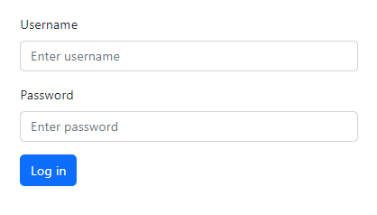
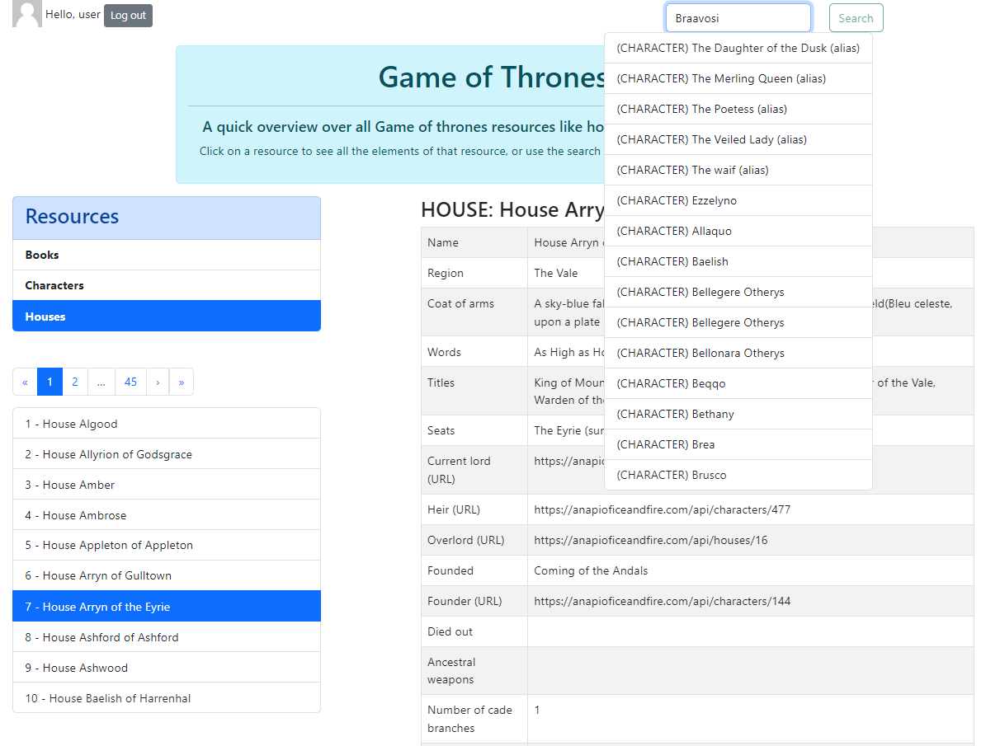
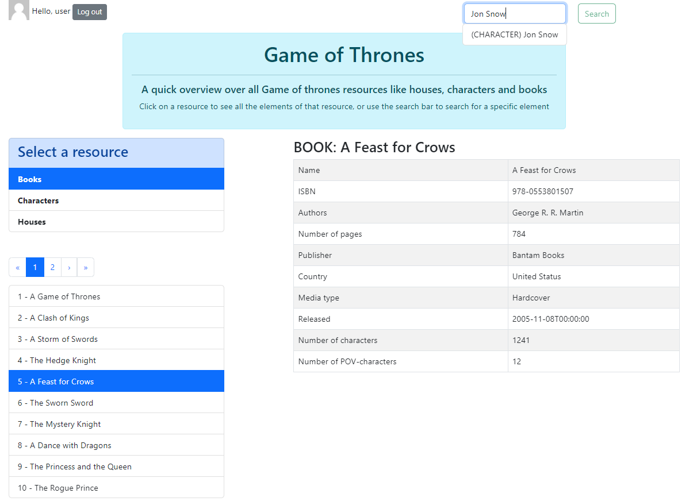

# Game of Thrones fan app

A quick overview over all Game of Thrones resources like houses, characters and books, based on the [Game of Thrones API](https://anapioficeandfire.com/).

## Project

This project was bootstrapped with [Create React App](https://github.com/facebook/create-react-app).

In the project directory, you can run:

### `npm start`

Runs the app in the development mode.\
Open [http://localhost:3000](http://localhost:3000) to view it in your browser.

## Technical details

* Use of TypeScript with `"strict": true`
* Use of *Redux Toolkit* :
    * To make all API GET requests with *Thunk*
    * To select an element, from the elements list or from the search results, and display a detail view in another component
* Use of *Context* and *local storage* to handle locally the user authentication (hardcoded)
* Use the default [pagination of the API provider](https://anapioficeandfire.com/Documentation#pagination) (page size = 10), except for search results (page size = 15)
* Use of *React-Bootstrap* to create a basic UI

## Limitations

* Search query and data filter depend on the [API provider filter parameters](https://anapioficeandfire.com/Documentation#root)
* Search works only for correct spelling and complete words for the fields below :
    * Book : name
    * Character : name, culture, born-died period
    * House : name, region, words

## Improvements 

* Activate more TypeScript rules
* Create types/interfaces for slices/actions/reducers
* Perform complex search
* Create more states for other use cases (loading, error...)
* Apply more styles for UI

## Example of usage

### Login

### Example 1

### Example 2
